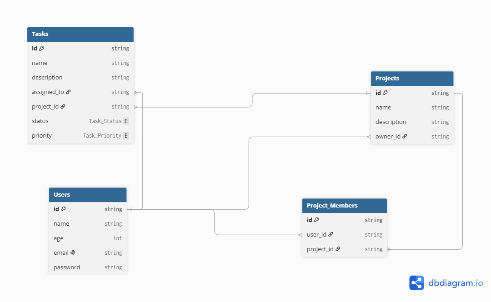

# Team Project Management System (CURT Backend Technical Task)

A robust backend REST API built for the **Cairo University Racing Team (CURT) – Software Development Team (Season 26-27)**.

The system enables teams to organize projects, manage tasks, assign responsibilities to project members, and track progress with authentication and data integrity enforcement.

---

> [!Note]
> only the README.md file is generated by ai.

## 🌐 Live Deployment

- **Live API Base URL**: `https://team-project-managment-system-production.up.railway.app/api/v1`
- **Hosted on**: [Railway](https://railway.app)
- **Database**: PostgreSQL hosted on [Neon](https://neon.tech)

---

## 🛠️ Tech Stack & Architecture

- **Runtime**: Node.js (ES Modules)
- **Framework**: Express.js 5
- **Database**: PostgreSQL (Cloud hosted on Neon)
- **ORM**: Prisma ORM
- **Authentication**: JWT (Access Token + Refresh Token rotation) & HTTP-only Cookies
- **Password Security**: bcrypt (salt rounds: 10)
- **Logging**: Morgan (`dev` logger)
- **Linting & Code Quality**: ESLint (Airbnb Base) + Prettier

---

## 📦 Project Structure

```
├── prisma/
│   ├── migrations/             # Prisma database migrations (with cascade rules)
│   ├── schema.prisma           # Prisma schema models & enums
│   └── seed.js                 # Database seeder with sample users, projects & tasks
├── src/
│   ├── config/
│   │   └── prisma.js           # Prisma client singleton & connection lifecycle
│   ├── controllers/
│   │   ├── authController.js   # Register, Login, Refresh, Logout
│   │   ├── projectController.js# Project CRUD, progress, and members management
│   │   └── taskController.js   # Task CRUD & task assignment validation
│   ├── middlewares/
│   │   ├── authMiddleware.js   # JWT authentication & cookie verification
│   │   ├── projectMiddleware.js# Project ownership & membership validation (403 guard)
│   │   └── taskMiddleware.js   # Task ownership & access validation (403 guard)
│   ├── routes/
│   │   ├── authRoutes.js       # /api/v1/auth routes
│   │   ├── projectRoutes.js    # /api/v1/projects routes
│   │   └── taskRoutes.js       # /api/v1/tasks routes
│   ├── utils/
│   │   └── generateTokens.js   # Access (10m) & Refresh (7d) JWT generators
│   ├── app.js                  # Express application setup & centralized error handlers
│   └── server.js               # Entry point (binds to 0.0.0.0 for cloud deployment)
├── .env.sample                 # Template for required environment variables
├── Team Managment System.postman_collection.json # Exported Postman collection
└── README.md
```

---

## 🚀 Getting Started (Run Locally)

### 1. Prerequisites

- Node.js (v18 or higher)
- PostgreSQL database (local or Neon/Supabase)

### 2. Clone the Repository

```bash
git clone https://github.com/Mahmoud-Fathy5/Team-Project-Managment-System.git
cd Team-Project-Managment-System
```

### 3. Install Dependencies

```bash
npm install
```

### 4. Configure Environment Variables

Create a `.env` file in the root directory based on `.env.sample`:

```env
DATABASE_URL="your-postgresql-connection-string"
PORT=3000
NODE_ENV="development"
ACCESS_TOKEN_SECRET="your-access-token-secret"
REFRESH_TOKEN_SECRET="your-refresh-token-secret"
```

### 5. Run Migrations & Seed Database

```bash
npx prisma migrate dev
npx prisma db seed
```

### 6. Start the Server

```bash
# Production mode
npm start

# Development mode (nodemon)
npm run dev
```

The server will start listening at `http://localhost:3000/api/v1`.

---

## 🗄️ Database Design & Models



- **User**: Stores user profile (`name`, `email`, `password` hash, `age`, `hashedRefreshToken`). Has relations to owned projects, assigned tasks, and project memberships.
- **Project**: Stores project details (`name`, `description`, `ownerId`). Deleting a project cascades deletion to associated tasks and project member records.
- **Task**: Belongs to a `Project` (`projectId`) and is assigned to a `User` (`assignedToId`). Includes `status` (`TODO`, `INPROGRESS`, `DONE`) and `priority` (`LOW`, `MEDIUM`, `HIGH`).
- **ProjectMember**: Join table implementing many-to-many relationship between `Project` and `User` with composite primary key `@@id([projectId, userId])`.

---

## 🧪 Seed Data (Ready for Immediate Testing)

When running `npx prisma db seed`, the database is populated with sample data:

### Sample Users:

| Name              | Email               | Password   | Age | Role in Seeded Project     |
| ----------------- | ------------------- | ---------- | --- | -------------------------- |
| **Mahmoud Fathy** | `mahmoud@gmail.com` | `password` | 20  | **Project Owner & Member** |
| **Mohamed Osama** | `Mohamed@gmail.com` | `password` | 32  | **Project Member**         |

### Sample Project:

- **Project Name**: `FlowChart sim`
- **Description**: `Computer engineering programming technique project`
- **Owner**: Mahmoud Fathy
- **Members**: Mahmoud Fathy, Mohamed Osama

### Sample Tasks:

1. `Make classes design UML` — Status: **DONE**, Priority: **HIGH**, Assignee: Mahmoud Fathy
2. `create classes` — Status: **INPROGRESS**, Priority: **HIGH**, Assignee: Mohamed Osama
3. `testing` — Status: **TODO**, Priority: **LOW**, Assignee: Mohamed Osama

---

## 📮 Postman Collection Usage & Setup

A pre-configured Postman collection is included in the root directory:  
📁 `Team Managment System.postman_collection.json`

### How to use it:

1. Open Postman -> Click **Import** -> Select `Team Managment System.postman_collection.json`.
2. Select the **Team Managment System** collection -> Go to the **Variables** tab.
3. Set the **`base`** variable value to:
   - For deployed testing: `https://team-project-managment-system-production.up.railway.app/api/v1`
   - For local testing: `http://localhost:3000/api/v1`
4. Click **Save** (`Ctrl + S`).

> [!IMPORTANT]
> **Note on Hardcoded IDs in Postman:**
> The saved Postman requests for `get project`, `update project`, `get task`, and `add member` contain sample UUIDs from development.
> After importing, please first run **Login** or **Get All Projects** / **Create Project**, copy the actual `id` from the JSON response, and paste it into the URL or body of the specific request you wish to test.

---

## 📖 API Endpoints Reference

Base URL prefix for all endpoints: `/api/v1`

### 1. Authentication (`/api/v1/auth`)

| Method | Endpoint         |  Auth  | Description                                                     | Request Body                                                      |
| ------ | ---------------- | :----: | --------------------------------------------------------------- | ----------------------------------------------------------------- |
| `POST` | `/auth/register` |   No   | Register a new user                                             | `{ "name": "...", "email": "...", "password": "...", "age": 20 }` |
| `POST` | `/auth/login`    |   No   | Login and obtain JWT tokens (set in cookies & returned in body) | `{ "email": "...", "password": "..." }`                           |
| `POST` | `/auth/refresh`  | Cookie | Rotate refresh token & issue new access token                   | _(Reads HTTP-only refreshToken cookie)_                           |
| `POST` | `/auth/logout`   |  Yes   | Logout user, clear cookies, invalidate refresh token in DB      | None                                                              |

### 2. Projects (`/api/v1/projects`)

| Method   | Endpoint                |     Auth     | Description                                                           | Request Body                                                                                   |
| -------- | ----------------------- | :----------: | --------------------------------------------------------------------- | ---------------------------------------------------------------------------------------------- |
| `POST`   | `/projects`             |     Yes      | Create a new project (creator automatically becomes owner & member)   | `{ "name": "Project Name", "description": "Details..." }`                                      |
| `GET`    | `/projects`             |     Yes      | List all projects the authenticated user belongs to                   | None                                                                                           |
| `GET`    | `/projects/:id`         | Yes (Member) | Get project details, member list, tasks, and task completion progress | None                                                                                           |
| `PATCH`  | `/projects/:id`         | Yes (Member) | Update project name and/or description                                | `{ "name": "...", "description": "..." }`                                                      |
| `DELETE` | `/projects/:id`         | Yes (Member) | Delete project (cascades tasks & memberships)                         | None                                                                                           |
| `GET`    | `/projects/:id/members` | Yes (Member) | List all members of a project                                         | None                                                                                           |
| `POST`   | `/projects/:id/members` | Yes (Member) | Add an existing user to the project                                   | `{ "userId": "<valid-user-uuid>" }`                                                            |
| `GET`    | `/projects/:id/tasks`   | Yes (Member) | List all tasks belonging to this project                              | None                                                                                           |
| `POST`   | `/projects/:id/tasks`   | Yes (Member) | Create a task within project (assignee must be a project member)      | `{ "name": "...", "description": "...", "priority": "HIGH", "assignedToId": "<member-uuid>" }` |

### 3. Tasks (`/api/v1/tasks`)

| Method   | Endpoint     |     Auth     | Description                                                                | Request Body                                 |
| -------- | ------------ | :----------: | -------------------------------------------------------------------------- | -------------------------------------------- |
| `GET`    | `/tasks`     |     Yes      | List all tasks assigned to the authenticated user                          | None                                         |
| `GET`    | `/tasks/:id` | Yes (Member) | Get single task details                                                    | None                                         |
| `PATCH`  | `/tasks/:id` | Yes (Member) | Update task properties (status, priority, name, description, assignedToId) | `{ "status": "DONE", "priority": "MEDIUM" }` |
| `DELETE` | `/tasks/:id` | Yes (Member) | Delete task                                                                | None                                         |

---

## 🛡️ Security & Data Integrity Features Implemented

1. **Password Hashing**: Securely hashed with `bcrypt` using 10 salt rounds. Plaintext passwords are never stored.
2. **Double Token Auth (JWT + Refresh Tokens)**: Short-lived access tokens (10 minutes) and long-lived refresh tokens (7 days) stored securely as SHA-256 hashes in the database.
3. **HTTP-only Cookies**: Protected against XSS attacks with `httpOnly: true`, `sameSite: 'strict'`, and dynamic `secure` flags for production.
4. **Ownership Enforcement (403 Forbidden)**: Unrelated users who are not members/owners of a project or task are immediately rejected with `403 Forbidden`.
5. **Task Assignment Validation**: Tasks cannot be assigned to arbitrary users; the assignee (`assignedToId`) must exist and belong to the respective project.
6. **Centralized Error Handling**: No raw stack traces or internal database errors leaked to clients in production.
7. **Database Cascading**: Deleting a project cleanly removes all related tasks and member associations without foreign key constraint violations.
